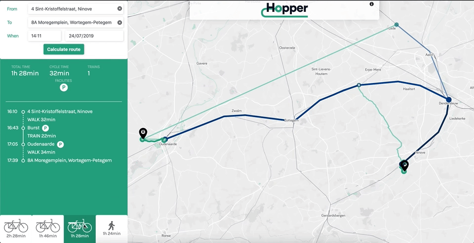

# Hopper
Electric bikes enable you to travel faster & further so that you get better connections. But they also have special needs such as safe parking.

Hopper is a **route-planner** that takes all those needs into account and allows you to combine your e-bike with train journeys. Change your commuting habits and contribute to sustainability!

Hopper is powered by Linked Open Data and [Itinero](https://www.itinero.tech/).

## Technologies
- JavaScript
- HTML
- CSS

## License 

This project is licensed under the MIT License.

<h2>Authors</h2>

- [Gulsen Guler](https://github.com/gulsenguler)
- [François Halin](https://github.com/fhalin)
-	[Kristof Neyt](https://github.com/Fizz55)
-	[Hervé Tendayi](https://github.com/HerveKurtis)
-	[Dieter De Schrijver](https://github.com/DieterDeSchrijver)

